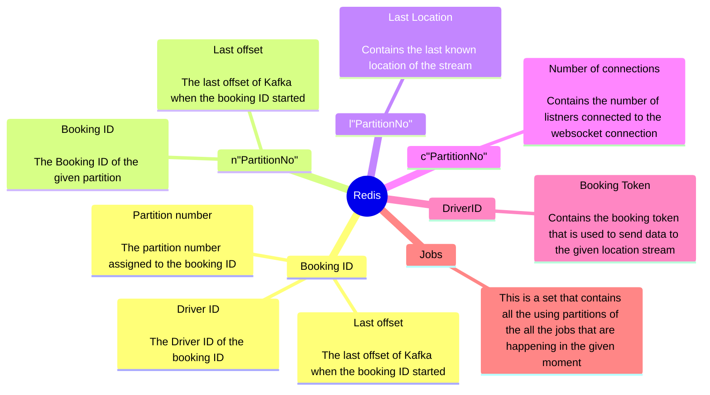

## Redis

```mermaid
mindmap
  root((Redis))
    Booking ID
      Partition number<br/><br/>The partition number assigned to the booking ID
      Last offset<br/><br />The last offset of Kafka when the booking ID started
      Driver ID<br/><br />The Driver ID of the booking ID
    n"PartitionNo"
      Booking ID<br/><br />The Booking ID of the given partition
      Last offset<br/><br />The last offset of Kafka when the booking ID started
    l"PartitionNo"
      Last Location<br/><br />Contains the last known location of the stream
    c"PartitionNo"
      Number of connections<br/><br />Contains the number of listners connected to the websocket connection
    DriverID
      Booking Token<br/><br />Contains the booking token that is used to send data to the given location stream
    Jobs
        This is a set that contains all the using partitions of the all the jobs that are happening in the given moment
```
